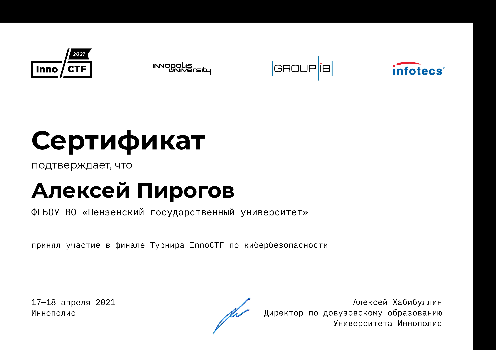
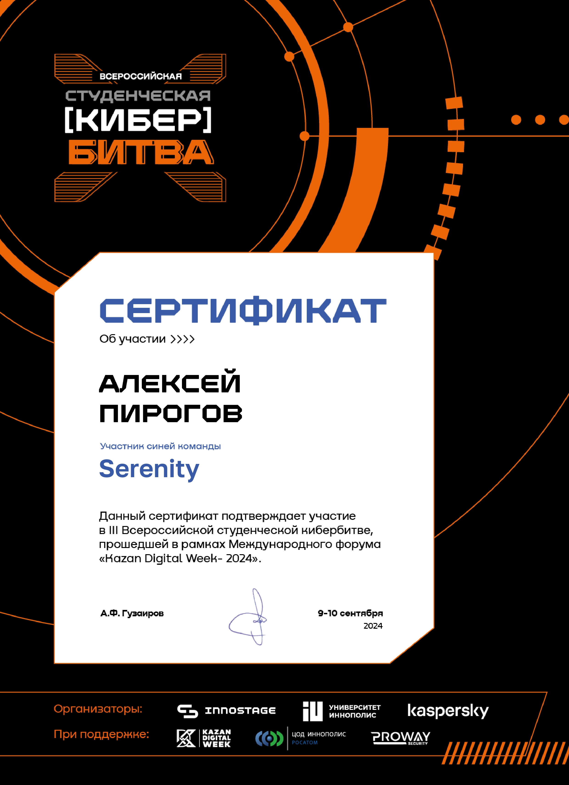
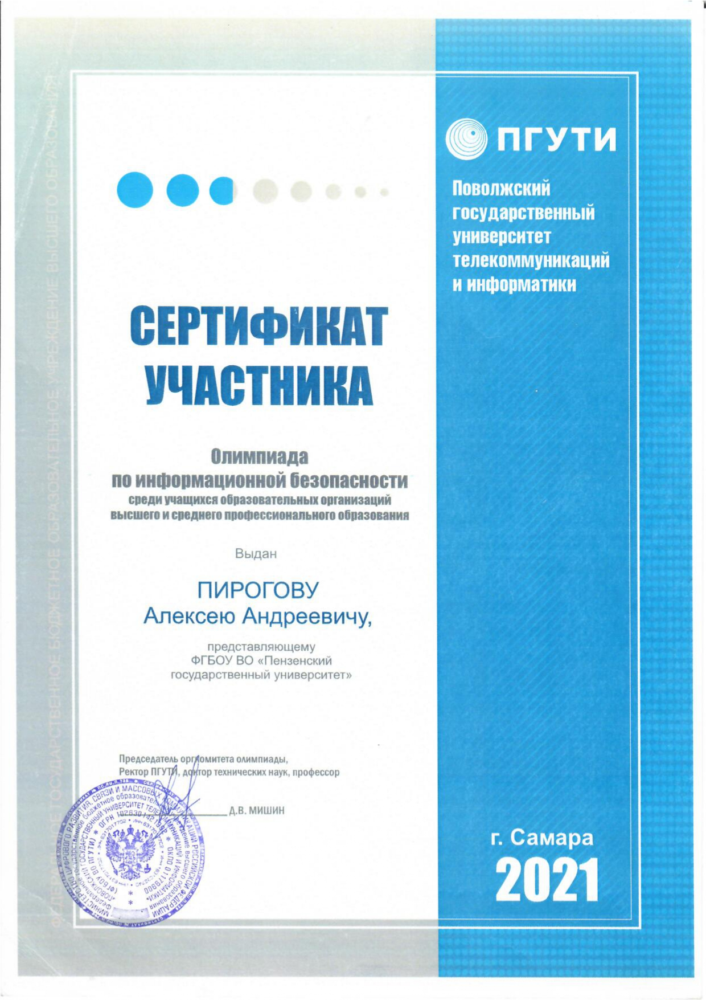
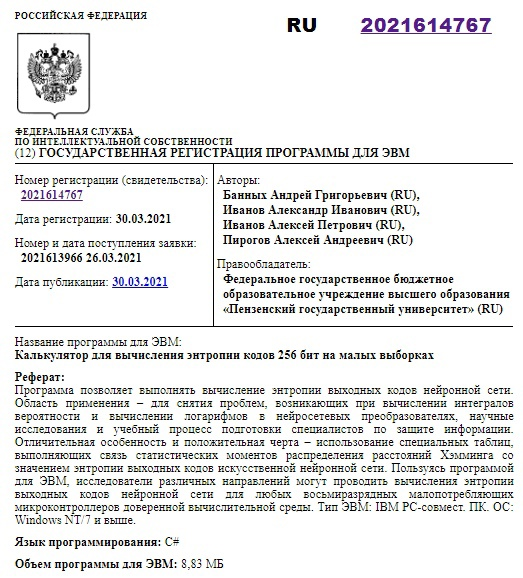

<h1 align="center"> Hi there </h1>

  
  
  

Hey, I'm <b>Alexey Pirogov</b>! 🚀

Recently graduated from <b>Penza State University</b> with a degree in <b>Information Security</b>. I've spent the last 2.5 years as a <b>Python Backend Developer</b> and <b>DevOps Engineer</b>, building everything from web apps to AI-powered tools. I specialize in creating secure systems, automating CI/CD pipelines, and making sure security is baked into every step of development (<b>DevSecOps</b>). Here, you'll find my projects and experiments with cool tech.

<ul>
<li> 🔭 Just wrapped up my thesis project: built an <a href="https://github.com/light-hat/immunity-iast"><b>IAST (Interactive Application Security Testing)</b></a> system to catch vulnerabilities on the fly.</li>
<li> 🌱 Deep in the <b>DevSecOps</b> world, baking security into CI/CD pipelines and catching vulnerabilities before they hit production.</li>
<li> 💻 I’ve got hands-on experience with <b>Python</b>, <b>Django</b>, <b>Docker</b>, <b>CI/CD</b> (Jenkins, GitLab CI), and <b>security tools</b> (Black Duck, static analysis, fuzzing).</li>
<li> 🤝 Looking to collaborate on projects that mix backend, DevOps, and cybersecurity.</li>
<li> 💬 Hit me up if you want to chat about Python, Django, Docker, or how to make your code more secure.</li>
<li> ⚡ Fun fact: I write scripts to simplify my life, including one that tracks how much coffee I drink in a day.</li>
</ul>

<h2 align="center"> 🛠️ My tech stack </h2>

<h2 align="center"> 📊 My profile stats</h2>

  

<h2 align="center"> 🏆 My various diplomas, certificates</h2>

<h2 align="center"> 💬 Contact me </h2>

Thanks for visiting my profile! Feel free to reach from if you have collaboration ideas!

